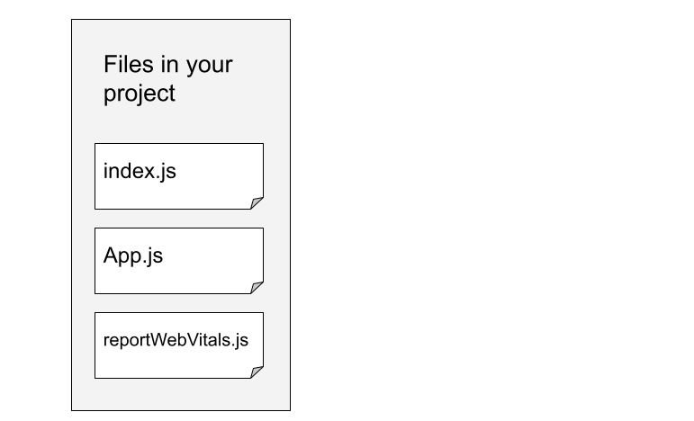
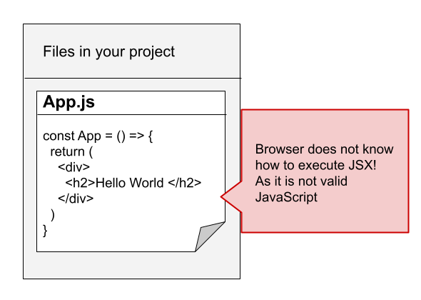

# Text
In the previous lesson, we've generated our new React project using `create-react-app`. Now let's jump into the project folder explore what's inside it and how things are working?

# Script
In this video, let's learn more about the files and folders that the `create-react-app`  has generated for us. So, I'll open the project in VS Code.
> Action: Open project in VS Code

Here, you'll be able to see a couple of files and folders inside the project. You'll also notice that there is a folder called `src`, and there are a bunch of files inside it.

Now, before we dive into those files too closely, I really want you to think of the previous lesson, when we generated our project and when we started to run our project at the terminal. There few questions might came to your mind like: 
- Why are we running anything at our terminal at all?
  
and

- What are all these files and folders? What are they doing for us?

Let's understand one by one:

So first, what are we running at our terminal when we start our project? 

Well, as you just saw, we have a couple of different files inside that `src` directory and some of them are `index.js`, `app.js` and `reportWebVitals.js`. Each of these files have some JavaScript code inside them. Inside the `index.js` and `app.js`, we've some JSX in there.

> Action: Show JSX code sample
 
JSX code looks familier with HTML. Now, we will learn more about JSX in-depth in upcoming lessons. 

But for now, I just want you to know that JSX is not a valid JavaScript code. In other words, your browser does not know how to execute JSX. If you try to execute JSX, you would end up getting an error, like 'syntax error'. We use JSX in React projects because it makes it very easy to make UI components. 

Now, as your browser does not know how to execute JSX, we have to *transpile* it before we try to run our project files inside the browser. The term *transpile* means we are taking one form of code and kind of changing it automatically into another form of code.

So the purpose of that thing that we're running inside of our terminal, is to take that JSX that exists inside of the `App.js` file right now, and turn it into a valid JavaScript that we can safely run inside the browser.

The thing that's running inside of our terminal is doing this entire process, we refer to as our *development server*. 
The dev server runs a couple of different tools internally to automatically take all these different files and the JSX inside them, turn them into normal JavaScript. The tool that does that, is called **Babel**.
Another tool is running inside the dev server as well, called **Webpack**. That tool takes all of our different files and kind of mashes them together into one file called the `bundle.js`.

So, whenever we try to access any website which is developed using React, the server first sends down the `index.html` file. Once the browser loads the HTML file, it makes a second request to get the `bundle.js` file. So, Webpack and Babel is responsible for generating the `bundle.js` file.
> Action: Show an animation in presentation to demonstrate the flow. 

So, that was short backstory on how, `Create React App` is helping us with React development. So, you can imagine that without `Create React App`, we had to manually install and configure all these different packages.

### OK, so let's do some cleanup!
The project generated by CRA has a lot of code which we don't need at the moment, so for the sake of simplicity I'll remove them all and will keep only the essential ones.
> Remove App.css
> Remove App.test.js
> logo.svg
> setupTests.js

The `App` function inside the `App.js` file is returning some code that looks like HTML, isn't it? But actually it's JSX. 

So, that's it for this lesson, see you in the next one.