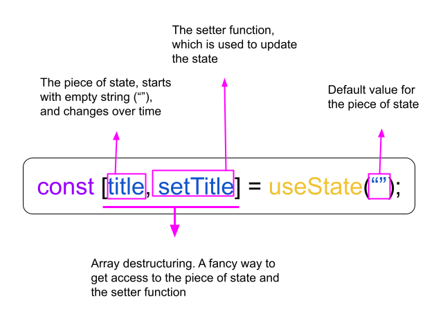

# Text

We can use `useState` hook to store the state in a function based component. The initialization call to `useState` returns a pair of values - the current state itself, and a setter function that updates it.

The syntax for `useState` hook is:

```tsx
import React, { useState } from "react";

function SampleComponent() {
  const [title, setTitle] = useState("");
  // ...
}
```



The initialization can also be done by passing a function.

```tsx
import React, { useState } from "react";


function SampleComponent() {
  const [title, setTitle] = useState(() => {
    return "";
  });
  // ...
}
```

Let us open the `TaskForm.tsx` file, and refactor it to make use of the `useState` hook.

We will create a new component in the `TaskForm.tsx` file named `TaskFormFC`.

```tsx
const TaskFormFC = (props: TaskFormProps) => {};
```

Let's use the `useState` hook to create our state variables in `TaskFormFC` component.

```tsx
const [formState, setFormState] = React.useState<TaskFormState>({
  title: "",
  description: "",
  dueDate: "",
});
```

We could have also create separate state variables for `title`, `description`, and `dueDate` like:

```tsx
const [title, setTitle] = React.useState("");
const [description, setDescription] = React.useState("");
const [sueDate, setDueDate] = React.useState("");
```

I wanted to show you, it is possible to use any object or array as a state.

Now, let's copy the functions which sets the state.

> Action: Copy setter functions `titleChanged`, `descriptionChanged`, `dueDateChanged` from class based implementation of `TaskForm`.

Now the editor shows a lot of errors, but it is quiet simple to resolve. These were member variables in the class component. We just have to add `const` before them, so that these are declared in this function context. So let's do that.

> Action: Add `const` keyword before `titleChanged`, `descriptionChanged`, `dueDateChanged` setters

Next, we will have to use the `setFormState` instead of `setTitle` and other setters.

```tsx
const titleChanged: React.ChangeEventHandler<HTMLInputElement> = (event) => {
  console.log(`${event.target.value}`);
  setFormState({ ...formState, title: event.target.value });
};
const descriptionChanged: React.ChangeEventHandler<HTMLInputElement> = (
  event
) => {
  console.log(`${event.target.value}`);
  setFormState({ ...formState, description: event.target.value });
};
const dueDateChanged: React.ChangeEventHandler<HTMLInputElement> = (event) => {
  console.log(`${event.target.value}`);
  setFormState({ ...formState, dueDate: event.target.value });
};
```

The setter in functional component, replaces the previous state. So, we will have to use the spread operator (`...`) to preserve any other values. If we had used seperate setters for `title`, `description` etc, we could have simply invoked the setter.

Let's update the `addTask` function next. We can drop the `this.state` and use `formState`. Also we can directly invoke `props.addTask` rather than `this.props.addTask`.

```tsx
const addTask: React.FormEventHandler<HTMLFormElement> = (event) => {
  event.preventDefault();
  console.log(`Submitted the form with`);
  if (formState.title.length === 0 || formState.dueDate.length === 0) {
    return;
  }
  props.addTask(formState);
  setFormState({ title: "", description: "", dueDate: "" });
};
```

Finally, let's update the JSX element.

```tsx
return (
  <form onSubmit={addTask}>
    <div className="grid md:grid-cols-4 md:gap-3">
      <div className="relative z-0 w-full mb-6 group">
        <input
          id="todoTitle"
          name="todoTitle"
          type="text"
          value={formState.title}
          onChange={titleChanged}
          className="block py-2.5 px-0 w-full text-sm text-gray-900 bg-transparent border-0 border-b-2 border-gray-300 appearance-none dark:border-gray-600 dark:focus:border-blue-500 focus:outline-none focus:ring-0 focus:border-blue-600 peer"
          placeholder=" "
        />
        <label
          htmlFor="todoTitle"
          className="peer-focus:font-medium absolute text-sm text-gray-500 dark:text-gray-400 duration-300 transform -translate-y-6 scale-75 top-3 -z-10 origin-[0] peer-focus:left-0 peer-focus:text-blue-600 peer-focus:dark:text-blue-500 peer-placeholder-shown:scale-100 peer-placeholder-shown:translate-y-0 peer-focus:scale-75 peer-focus:-translate-y-6"
        >
          Todo Title
        </label>
      </div>
      <div className="relative z-0 w-full mb-6 group">
        <input
          id="todoDescription"
          name="todoDescription"
          type="text"
          value={formState.description}
          onChange={descriptionChanged}
          placeholder=" "
          className="block py-2.5 px-0 w-full text-sm text-gray-900 bg-transparent border-0 border-b-2 border-gray-300 appearance-none dark:border-gray-600 dark:focus:border-blue-500 focus:outline-none focus:ring-0 focus:border-blue-600 peer"
        />
        <label
          htmlFor="todoDescription"
          className="peer-focus:font-medium absolute text-sm text-gray-500 dark:text-gray-400 duration-300 transform -translate-y-6 scale-75 top-3 -z-10 origin-[0] peer-focus:left-0 peer-focus:text-blue-600 peer-focus:dark:text-blue-500 peer-placeholder-shown:scale-100 peer-placeholder-shown:translate-y-0 peer-focus:scale-75 peer-focus:-translate-y-6"
        >
          Description
        </label>
      </div>
      <div className="relative z-0 w-full mb-6 group">
        <input
          id="todoDueDate"
          name="todoDueDate"
          type="date"
          value={formState.dueDate}
          onChange={dueDateChanged}
          className="block py-2.5 px-0 w-full text-sm text-gray-900 bg-transparent border-0 border-b-2 border-gray-300 appearance-none dark:border-gray-600 dark:focus:border-blue-500 focus:outline-none focus:ring-0 focus:border-blue-600 peer"
          placeholder=" "
          required
        />
        <label
          htmlFor="todoDueDate"
          className="peer-focus:font-medium absolute text-sm text-gray-500 dark:text-gray-400 duration-300 transform -translate-y-6 scale-75 top-3 -z-10 origin-[0] peer-focus:left-0 peer-focus:text-blue-600 peer-focus:dark:text-blue-500 peer-placeholder-shown:scale-100 peer-placeholder-shown:translate-y-0 peer-focus:scale-75 peer-focus:-translate-y-6"
        >
          Due Date
        </label>
      </div>
      <div className="relative z-0 w-full mb-6 group">
        <button
          type="submit"
          className="text-white bg-blue-700 hover:bg-blue-800 focus:ring-4 focus:outline-none focus:ring-blue-300 font-medium rounded-lg text-sm w-full sm:w-auto px-5 py-2.5 text-center dark:bg-blue-600 dark:hover:bg-blue-700 dark:focus:ring-blue-800"
        >
          Add item
        </button>
      </div>
    </div>
  </form>
);
```

> Action: rename `TaskFromFC` to `TaskForm` and remove old component.

Now, let's remove class based implementation of `TaskForm`, and rename new component ie, `TaskFormFC` as `TaskForm`. Save the file.

Visit `localhost:3000` in browser and everything should work as before.
